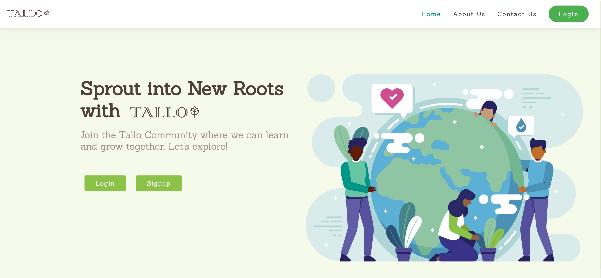
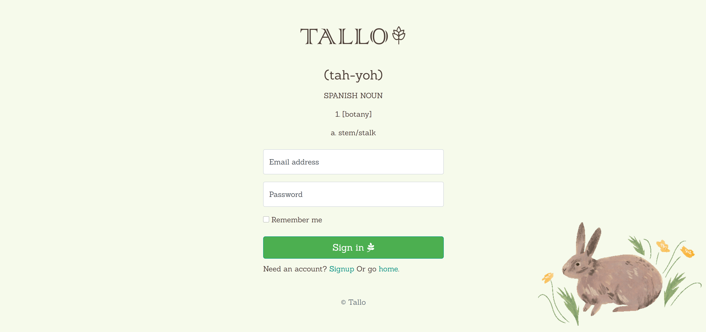
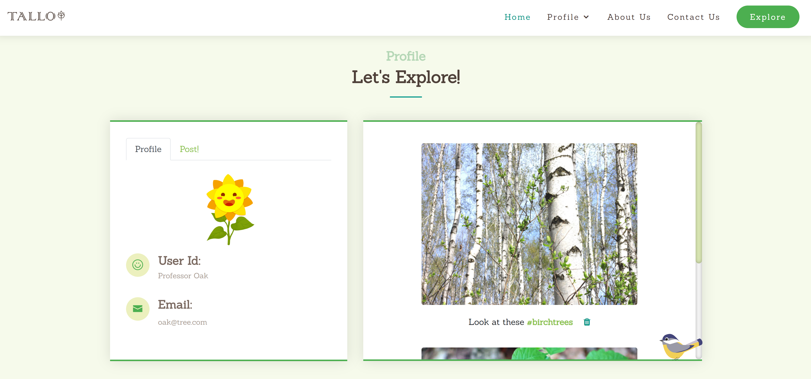
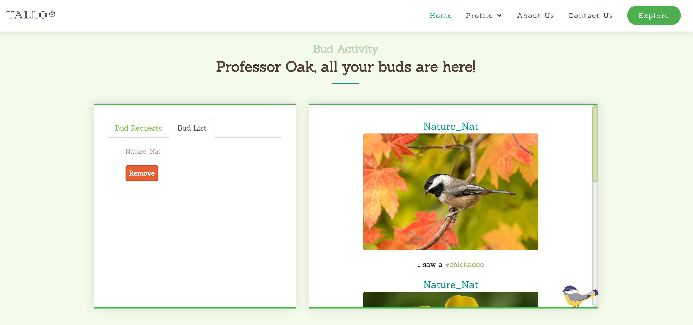
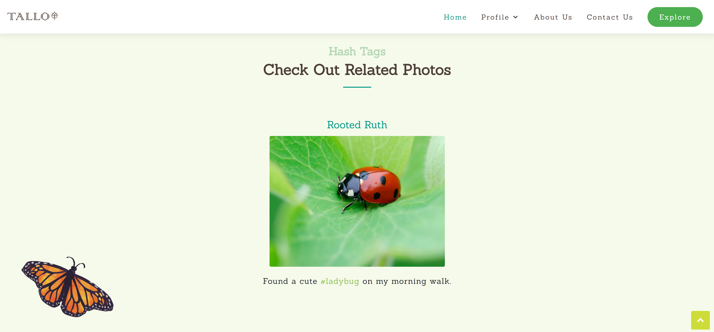
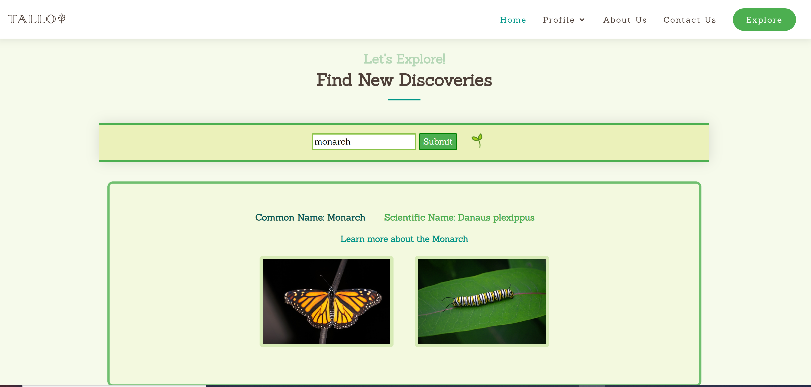

# Tallo: Cultivating Community application

Live Code: https://tallo.herokuapp.com/

# How It's Made:
### Tech used: 
EJS, CSS, JS, Bootstrap, Node.js, Express, MongoDB, and Passport. 

### Login Page

### User Profile:
Here users can see their own posts, upload images and view profile information

### Community Page: 
Find out what others are posting and when you hover over the images you have the option go to the poster's public profile or that photo's comment section.

### Buds Page:
Just want to see what your friends are up to? Look a the buds feed to find out. Also accept/deny any friend requests.

### Hashtag Page:
Find related photos by clicking the hashtag in a photo caption.

### Explore Page:
Learn more about the world around us with the Explore page. Search bugs, plants or other organisms to discover.

# Lessons Learned:
How to better structure an application with multiple pages and routes. Organization was important during the build of this project. I brainstormed how the wireframe was going to be on the backend and thought of the main key features I wanted to create. implementing the friends feature and feed was challenging but I learned how to work with multiple collections from a database. 

# Examples:

Take a look at these couple examples that I have in my own portfolio:

Wu-Tang Generator: https://github.com/Kim-Flores/wu-tang-generator-bootcamp/tree/answer

Palindrome Checker: https://github.com/Kim-Flores/node-palindrome-bootcamp/tree/answer

Coin Flip: https://github.com/Kim-Flores/node-coin-flip-bootcamp/tree/answer

